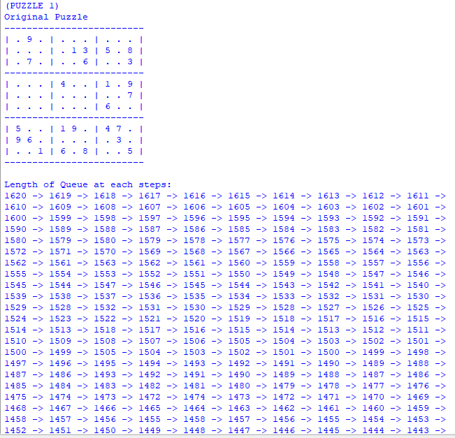
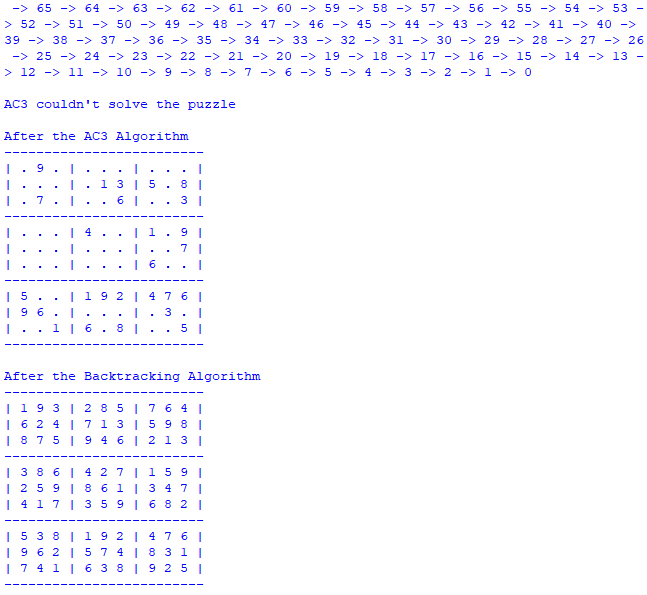

# Sudoku-Solver
CP-468 Group 15 Assignment 2

Matthew Nitsopoulos (170673880) 
Harkaran Grewal (170531870) 
Min-Ho Choi (170813020) 
Ravish Virani (173084290) 
Jungeun Choi (156803830) 

# Introduction
In a standard Sudoku puzzle (9x9 grid), there are 81 variables/tiles in total. Each variable is named by its row and its column, and must be assigned a value from 1 to 9, subject to the constraint that no two cells in the same row, column, or box may contain the same value. The initial configuration of sudoku is a partially filled board. The objective is to solve the puzzle such that all the constraints are satisfied. As the given problem has a list of constraints to be satisfied, CSP solutions work efficiently for the sudoku problem as well.

# Representation
We chose to represent the sudoku puzzle as a dictionary of values in python. Each position of the board is represented by an alphanumeric situating list. The row are represented by the letters A-I and the columns are represented to by the numbers 1-9. The positions are constantly composed with the row represented first followed by the column. Ex. "A2". At each position, there is a cell object that contains the lists of cells that it is identified with just as the current area of qualities that the cell can hold. This is the way the sudoku board is spoken to as a CSP.

# Code Description
A3_algo : Implemets the AC3 algorithm, Gets the all ARCs for soduku puzzle, prints the Sudoku puzzle and formats the output.
Cell : Defines the cells of the Sudoku puzzle
backtrack : Implementation of Backtracking through Minimum Remaining Values and the Degree heuristic

# Environment
Language : Python-3

# How to run?
Input the sudoku puzzle in sudoku.txt with "." for empty spaces.

Run python A3_algo.py

The output will display the unsolved puzzle, length of queue and finally the solved puzzle.

# Sample Runs
A note about inputs. Must have 81 characters on a line and the file MUST end with a new line

 
 

